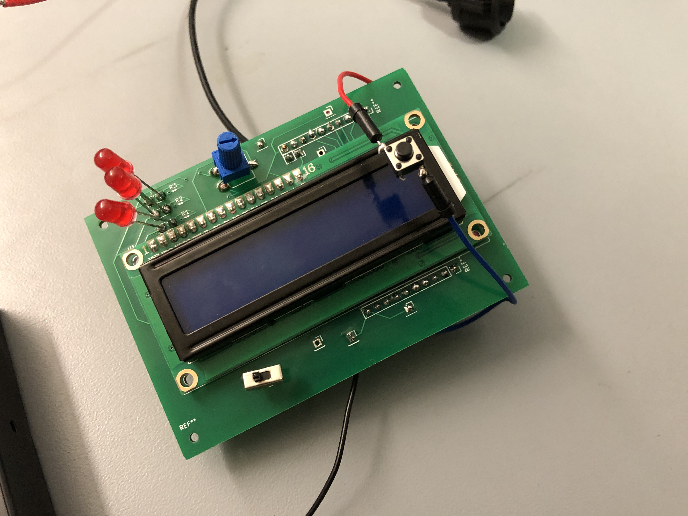

<h1> 🇺🇸 Carlos Ortiz 🇲🇽 </h1>
<h4> 
  🎮
  <a href="../Ortiz_Resume1v2.pdf">Resume</a>
   · 
  <a href="https://cartex10.github.io/whoami/whoami.html">Who Am I?</a>
   · 
  <a href="https://github.com/cartex10">GitHub</a>
  🎮
</h4>

# Current Projects
- [Vetcon Badge](/vetcon/vetcon.md)

- [MiniBot](/minibot/minibot.md)
- [temp](templates/completed_project.md)

# Past Projects
- [RotomBot](/rotombot/rotombot.md)
- [DMH](/dmh/dmh.md)
- [RandoDex](/randodex/randodex.md)
- [EC444](/ec444/ec444.md)
- [EC327](/ec327/ec327.md)
